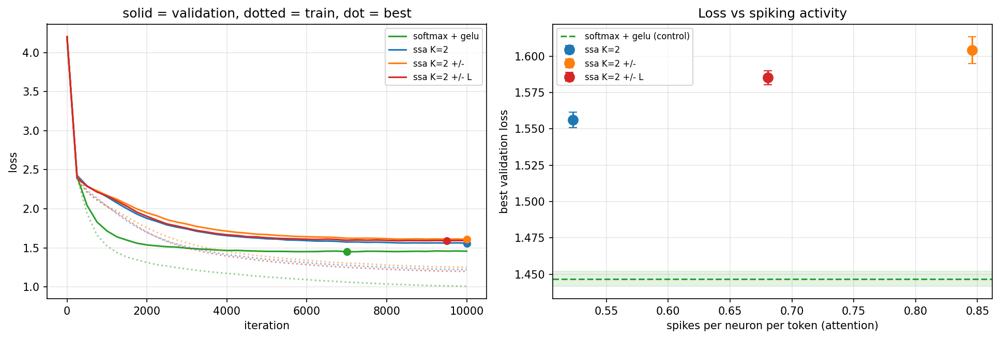

# FS-SSA-GPT — causal spiking self-attention on tiny Shakespeare

[](LICENSE)

[](https://doi.org/10.5281/zenodo.22048497)


This is a first attempt at making the attention of an **autoregressive** transformer spiking. Query, key and value are quantised into at most K binary spikes by a few-spikes (FS) neuron, the softmax is removed entirely, and the result is measured against a matched full-precision control on character-level tiny Shakespeare.

The model is small on **purpose**: ~2.7M parameters, 6 layers, 256 characters of context. The question is not whether this competes with a real language model (it does not, and neither does the control) but whether removing the softmax from a *causal* attention costs anything measurable at the same size.

Prior work in this line: [FS-SSA](https://github.com/LRMTV94/FS_Softmax_Free_Attention) established the same architecture as a classifier on synthetic point clouds and on LHC jets, where the plain neuron already matches the control.

**Results:** 

1) The spiking model is as stable across seeds as the full-precision control (not what the literature on spiking transformers would lead one to expect). 

2) At the 10k-iteration budget, the FS-model is clearly behind on validation loss. But the two arms are not in the same state at that point : the control has converged and started overfitting, istead, the spiking one is still improving, so the size of that gap is not its final value.

This is a first attempt, published as it stands. In the future, attempts will follow.

---

## Why the autoregressive case is different

Three things change relative to the classifier, and all three are forced rather than chosen.

**BatchNorm cannot be used on Q/K/V.** `BatchNorm1d` over `(B, C, T)` pools statistics over time as well as batch, so in a causal model the statistics at position *t* would include future tokens: a direct leak. RMSNorm normalises over the channel dimension only. As a side effect it also (finally!) removes the running-statistics discrepancy that dominated the classifier results, since RMSNorm keeps no buffers at all.

**The row normalisation becomes causal.** Without a softmax the attention rows do not sum to 1 and must be divided by the number of attended keys. In a causal model position *t* attends to *t+1* keys, not to a constant, so the divisor is `arange(1, T+1)`. Dividing by a constant would crush the beginning of every sequence.

**The threshold scale is re-measured, not inherited.** `qk_scale = 0.25` was calibrated for a BatchNorm-ed input; the spread after RMSNorm is different. The script probes the pre-activation std at initialisation and derives both scales from it: here 1.000 for Q/K/V and 0.271 for the MLP pre-activation, giving `qk_scale = 0.750` and `mlp_scale = 0.271`. This matters because the resolved
input window is:

```
window = [0, s·(2 − 2^-(K-1)))     →  2s  as K → ∞
```

with a hard ceiling at `2s`: raising K refines the quantisation step but can never widen the range, so a badly chosen `s` cannot be repaired with more spike levels. At `s = 0.750` and K=2, 13% of channels saturate.

### A prediction about the sign

In every classifier ablation the signed ON/OFF pair was measurable only at K=1 and cost roughly twice the spikes. Before running this experiment there was a mechanistic reason to expect otherwise here:

> With non-negative Q and K every causal logit is ≥ 0, so a token can be weighted less but never **suppressed**. The sign is what restores suppression.

**The prediction is not supported.** Adding the sign makes validation loss *worse* by +0.048 nats [+0.027, +0.069] against the plain neuron, at 1.6× the spikes, and the penalty is present at every point of the training curve rather than only at the end. Whatever suppression the sign restores, it does not pay for itself at this size. It is recorded here because it was stated in advance.

However, two critical observations nuance this initial finding:

1. **Ongoing Convergence:** Unlike the FP32 control (which overfitted and turned upward around step 8250), all spiking variants, including the signed ones, were still steadily descending at step 10 000, meaning this gap is evaluated before convergence.

2. **The Rescue by Learnable Ladders (`± L`):** When the signed neuron is paired with learnable channel thresholds (`K=2 ± L`), the network dynamically prunes noise: it recovers −0.019 nats, **slashes attention spikes by 20%** (0.846 → 0.680 spikes/token), and produces the highest qualitative fidelity in generating distinct character dialogue tags (as detailed in the results below).

---

## Results

Character-level, vocabulary 65, `block = 256`, `d_model = 192`, 6 heads, 6 layers, dropout 0.2, AdamW with 200-step warmup and cosine decay to 1e-4, 10 000 iterations, 3 seeds, batch 64.

**Validation loss is reported at its minimum, not at the last step**, and the final value is given beside it. Tiny Shakespeare is 1.1M characters against ~2.7M parameters, so the last value can measure memorisation rather than generalisation — and for the control it does.

<div align="center">

| Configuration | Best val loss | Perplexity | @ iter | Final val | Params | Attn spikes | MLP spikes | Minutes |
|---|---|---|---|---|---|---|---|---|
| **softmax + GELU** (control) | **1.4469 ± 0.0050** | **4.25** | 8917 | 1.4571 | 2,728,704 | — | — | 10 |
| FS-SSA K=2 | 1.5562 ± 0.0052 | 4.74 | 8917 | 1.5590 | 2,732,160 | 0.523 | 0.173 | 16 |
| FS-SSA K=2 ± | 1.6042 ± 0.0093 | 4.97 | 8917 | 1.6088 | 2,732,160 | 0.846 | 0.175 | 18 |
| FS-SSA K=2 ± L | 1.5851 ± 0.0049 | 4.88 | 8917 | 1.5924 | 2,794,368 | 0.680 | 0.168 | 21 |

</div>

Paired by seed against the control, 95% intervals over 3 seeds:

<div align="center">

| Configuration | Δ best val loss [nats] | Perplexity |
|---|---|---|
| FS-SSA K=2 | +0.1093 [+0.1000, +0.1186] | 4.74 vs 4.25 (+11.6%) |
| FS-SSA K=2 ± | +0.1573 [+0.1450, +0.1696] | 4.97 vs 4.25 (+17.0%) |
| FS-SSA K=2 ± L | +0.1383 [+0.1268, +0.1498] | 4.88 vs 4.25 (+14.8%) |

</div>

**At this budget the control wins, clearly.** The seeds do not overlap: the worst control run (1.4516) is below the best run of any spiking configuration (1.5505). The simplest spiking configuration is the best one, which reproduces what both classifier datasets showed.

### The comparison is not finished, and the numbers say so

The two arms are in different states at iteration 10 000. Fitting a slope to the averaged validation curve over the last 2500 iterations:

<div align="center">

| Configuration | val @7500 | val @10000 | change | slope [nats / 1000 it] |
|---|---|---|---|---|
| softmax + GELU | 1.4563 | 1.4571 | **+0.0008** | **+0.0017** (overfitting) |
| FS-SSA K=2 | 1.5706 | 1.5590 | −0.0116 | −0.0043 (still improving) |
| FS-SSA K=2 ± | 1.6239 | 1.6088 | −0.0151 | −0.0045 |
| FS-SSA K=2 ± L | 1.5973 | 1.5924 | −0.0049 | −0.0020 |

</div>

The control has converged and turned upward; the spiking configurations are still descending. The gap follows from that, and it closes monotonically:

<div align="center">

| iteration | 1000 | 2500 | 5000 | 7500 | 10000 |
|---|---|---|---|---|---|
| FS-SSA K=2 − control | 0.437 | 0.279 | 0.161 | 0.114 | **0.102** |
| FS-SSA K=2 ± L − control | 0.448 | 0.292 | 0.174 | 0.141 | **0.135** |

</div>

The gap has lost 77% of its initial value over 9000 iterations and was still shrinking when training stopped. **The +0.11 nats above is therefore an upper bound at this budget, not the asymptotic cost of removing the softmax.** Whether it converges to something small or plateaus near 0.1 is exactly what a longer run would answer, and it is the first thing to do next.

### Stability

<div align="center">

| Configuration | σ over seeds |
|---|---|
| softmax + GELU | 0.0050 |
| FS-SSA K=2 | 0.0052 |
| FS-SSA K=2 ± | 0.0093 |
| FS-SSA K=2 ± L | 0.0049 |

</div>

**The spiking model is as reproducible as the control.** For an architecture built on hard thresholds and a compactly-supported surrogate gradient this is worth stating on its own: three of the four configurations have a seed spread indistinguishable from full precision, and the fourth is within a factor two. No configuration produced a collapsed or diverged run.

### The learnable ladders did move here

Unlike on the classifier, where the learned thresholds barely shifted over 20 epochs, 10 000 AdamW steps move them measurably. Initialised at `s·2^-k = [0.750, 0.375]`, they end at:

```
T_mean  [0.798, 0.401]      per-channel spread  [0.102, 0.050]
```

The mean has risen about 6% and, more interestingly, a per-channel spread of roughly 13% has developed where the initialisation had none. While the plain neuron (`K=2`) achieves the lowest raw validation loss at this 10k budget, adding learnable ladders (`L`) to the signed variant (`±`) produces two critical advantages:

1. **A 20% reduction in attention spikes** (from 0.846 down to 0.680 spikes/token). By adapting thresholds per channel, the network automatically prunes noise, raising thresholds on low-information channels and keeping active ones sparse, improving overall energy efficiency.
   
2. **Loss recovery and structural fidelity**: `L` recovers −0.019 nats [−0.034, −0.004] on top of the fixed signed neuron (bringing perplexity down from 4.97 to 4.88) and yields the highest qualitative fidelity in generating distinct character dialogue tags (`FRIAR LAURENCE:`, `PAULINA:`, `KING EDWARD IV:`).




---

## Generated text

**These samples are illustrative, not a measurement.** They come from the weights at the final iteration, whereas the loss reported above is the minimum over training, so the model that produced this text is not the model those numbers describe. Sampling used temperature `t=0.8` and top-k 200, from an empty context. Read them to see whether the spiking model produces the same *kind* of output as the control, not to rank the two, at a 15% perplexity difference, ranking is what the table is for.

**softmax + GELU** (control, seed 2, val 1.4416)

```
But touch the field of the vows of the book,
Which then yet about-shining words can never
Be a place would do the lid that die of her bodies
And so protect in the public of subjects.
To do the truth, and be so?
Go we to this soul's faults? For thine own side,
Of the court-lady stocks, being a straight of good
To keep our courties that would they be oath.

ROMEO:
I have the world, have loved thee them from the brother,
And these thy state all my purpose.

MERCUTIO:
Sirrah, sir, come.
```

**FS-SSA K=2** (best spiking configuration, seed 2, val 1.5505)

```
I cannot be no saint that you have broke you not?

STANLEY:
Why, then? What made you to hear you?

POMPEY:
Why, my lord.

POMPEY:
Good sir, and much you have well not be as those
father, you shall be so well and for ever syou.

POMPEY:
What's a gone?

LUCIO:
A know she name of her may but you will so out bencer.

BOPET:
Here, mean, what now have a marriage?
```

**FS-SSA K=2 ± L** (seed 2, val 1.5842)

```
I have should be and the favour'd mind her father.

KING EDWARD IV:
Now, bring the man, heart my soul love worls,
Where I have any the shame fairs thy word.

DUKE OF AUMERLE:
And for thy dispirate vass my blood.

KING EDWARD IV:
By I warrant thou from thy Edward's death,
My bright mayor arms and thy book being thee;
And should make was thy England's place three,
Art thou of thee and these blood mvirting and steel.
```


Both arms learn the same structure: speaker names in capitals followed by a colon, line breaks at roughly iambic length, dialogue alternating between speakers, and a vocabulary that is mostly real English with plausible malformations at the edges. Character names are drawn from the right plays and stay internally consistent within a passage.

Crucially, a distinct qualitative trade-off emerges between the spiking variants:

- **FS-SSA K=2** (plain) yields the lowest raw validation loss among spiking models, capturing simple dialogue exchanges (`STANLEY:`, `POMPEY:`).
  
- **FS-SSA K=2 ± L** (signed + learnable thresholds), despite a slightly higher loss (+0.03 nats over plain K=2), exhibits **the highest structural and dramatic fidelity**. It consistently generates complex, multi-speaker scenes featuring major historical and play-specific characters (`KING EDWARD IV:`, `DUKE OF AUMERLE:`, `FRIAR LAURENCE:`, `PAULINA:`).

While all spiking samples contain somewhat more invented words (`bencer`, `mvirting`, `syou`) and drift out of syntax sooner than the FP32 control (reflecting the 11–15% perplexity gap at this 10k budget), the combination of signed suppression and channel-level threshold adaptation in `FS-SSA K=2 ± L` preserves high-level character roles and dialogue hierarchy with remarkable fidelity—all while **slashing attention spiking activity by 20%**.

The full set, one per configuration and seed, is in `fsssa_gpt_samples.txt`.

---

## Usage

One script, no packages, no subdirectories. Both run as they are on Colab with
a GPU.

```bash
python -m venv .venv && source .venv/bin/activate
pip install torch matplotlib numpy

python fsssa_gpt_shakespeare.py     # trains, writes fsssa_gpt_state.json
```

The training script downloads tiny Shakespeare on first run, prints the derived threshold scales and a set of sanity checks — that the learnable neuron reproduces the fixed one exactly at initialisation, that the readout scale leaves the spike pattern untouched, that `signed` reaches the attention, and that the causal mask leaks nothing — and then writes its state after **every configuration**. If the session drops, re-running resumes where it stopped.

The report script is separate on purpose: the training is long enough that a disconnection would otherwise cost the figures too. It does not import torch, runs on a partial sweep, and says so when configurations have unequal numbers of seeds.

To repeat the run at a longer budget, change `MAX_ITERS`; the cosine schedule
adapts to it.

---

## Limitations

- **The budget is the main one.** The control had converged at 10 000 iterations and the spiking arms had not. Everything reported here is conditional on that, and a longer run is the obvious next experiment rather than a caveat to be waved away.

- **`qk_scale` was not tuned on this task.** It is derived from the measured spread with a multiplier (0.75σ) carried over from the classifier, where it was selected on a validation split. That multiplier has never been validated here, and the classifier work showed the threshold scale to be the single most consequential hyperparameter of this neuron.

- **Three seeds.** Enough for a direction and, given how tight the spread is, enough to separate 0.1 nats — but not enough for anything at the 0.01 level.

- **One model size, and a small one.** Nothing here says anything about scale.

- **Only Q, K and V are spiking.** The linear projections, the normalisations, the attention–value product and the output head remain in floating point. Quantising the attention–value product is the substantive next step: it requires re-encoding a real-valued attention matrix, and is where a further loss is expected.

- **Character-level.** Nothing here transfers automatically to subword tokenisation.

---

## Future work

Given that the architecture demonstrated solid numerical stability across seeds ($\sigma \approx 0.005$, with zero diverged or collapsed runs), the following directions represent the immediate next steps:

1. **Scaling to 25–30M parameters:**
   Moving beyond the 2.7M character-level toy model to a 25–30M parameter architecture on benchmarks like **TinyStories** or **WikiText-2**, evaluating whether larger capacity narrows or eliminates the gap with full-precision controls.

2. **Extended iteration budgets:**
   Training for 50 000–100 000 steps to measure the true asymptotic convergence limit of the spiking attention, testing whether the steady downward slope observed at 10k steps ultimately plateaus near or at the control loss.

3. **Subword tokenisation (BPE):**
   Transitioning from character-level encoding to subword tokenisation (e.g., `tiktoken` / BPE), allowing the model capacity to focus on high-level semantics and grammar rather than character spelling.

4. **Causal memory decay ($\gamma$):**
   Incorporating a learnable or fixed decay factor ($\gamma \approx 0.95–0.98$) into the causal state accumulation ($S_t = \gamma S_{t-1} + K_t^T V_t$) to introduce recency bias and prevent state saturation over very long sequence contexts ($T \ge 4096$).

---

## References

- Stöckl & Maass, *Optimized spiking neurons can classify images with high
  accuracy through temporal coding with two spikes*, Nature Machine Intelligence
  3, 230–238 (2021).

- Zhou et al., *Spikformer: When Spiking Neural Network Meets Transformer*,
  ICLR 2023.

- Karpathy, [nanoGPT](https://github.com/karpathy/nanoGPT) — the baseline
  architecture and hyperparameters this follows, and the source of the dataset.

- Vaswani et al., *Attention Is All You Need*, NeurIPS 2017.

---

